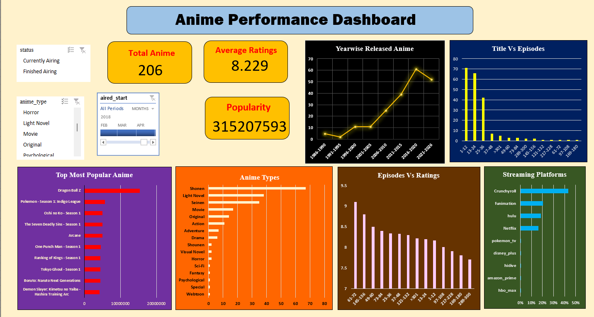

# Anime_Performance_Dashboard in Microsoft Excel


## Project Overview
This project demonstrates the complete process of cleaning an anime dataset and building an interactive dashboard using Microsoft Excel. The dataset contained missing values, duplicate records, inconsistent text, mixed date formats, and invalid entries. After cleaning the data, Pivot Tables, Pivot Charts, Slicers, and Timeline were used to create an interactive anime performanec dashboard.


## Tools Used
- Microsoft Excel
- Pivot Tables
- Pivot Charts
- Slicers
- Timeline


## Dataset
The dataset contains sales transaction data including:
- `anime_id`
- `title`
- `anime_type`
- `episodes`
- `status`
- `aired_start`
- `aired_end`
- `year`
- `rating`
- `popularity`
- `genres`
- `genres_count`
- `netflix`
- `crunchyroll`
- `amazon_prime`
- `hulu`
- `funimation`
- `disney_plus`
- `hbo_max`
- `hidive`
- `pokemon_TV`
- `streaming_platforms_count`
- `Count`
- `streaming_platforms`
- `share_percentage`


## Data Cleaning
The following cleaning operations were performed in Microsoft Excel:

- Removed blank anime_ids
- Removed duplicate records
- Trimmed extra spaces
- Standardized title 
- Removed non-printable patterns from title
- Converted mixed date formats into valid Excel dates


## Dashboard Features
The dashboard includes:

### KPI Cards

- Total anime_ids
- Average rating
- Popularity

### Insights & Charts
- Yearwise anime Trend
- Title vs Episodes
- Episodes vs Ratings
- Anime Types
- Top 10 Animes
- Streaming_platform Analysis
- Interactive Slicers
- Timeline Filter


## Excel Features Used
- Remove Duplicates
- Pivot Tables
- Pivot Charts
- Slicers
- Timeline


## Project Structure
```text
Anime_Performance_Dashboard/

│── Dataset/
│     Project_anime_dataset.xlsx       

│── Dashboard/
│     Anime_Performance_Dashboard.xlsx

│── Screenshots/
│     Dashboard.png

│── README.md
```
## Dashboard Preview



## Outcome
The cleaned dataset was transformed into an interactive Excel dashboard that enables quick analysis of an anime performance using filters, charts, KPIs, and timelines.

## Author
Himanshi Natiye

-**GitHub:**[Himanshi Natiye](https://github.com/himanshimnatiye)
-**LinkedIn:**[Himanshi Natiye](https://www.linkedin.com/in/himanshi-natiye-54884241a/)